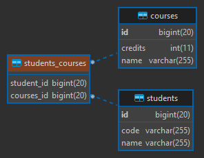
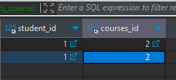
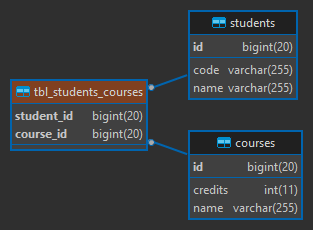
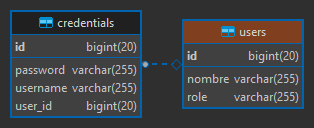
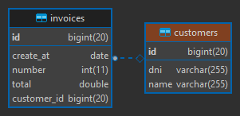
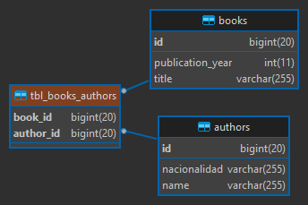

# Asociaciones de entidades usando JPA/Hibernate (Spring Data JPA): Unidireccionales y Bidireccionales

---

[Fuente: adictosaltrabajo](https://www.adictosaltrabajo.com/2020/04/02/hibernate-onetoone-onetomany-manytoone-y-manytomany/)

## Asociaciones Unidireccionales

### One To One (Unidireccional)

- La anotación @OneToOne en un tipo de relación unidireccional podría
  estar en cualquiera de las dos entidades relacionadas (Port o Service).
  Decidir en qué entidad irá la relación, dependerá del análisis que hagamos y
  cómo quisiéramos manejarlo.
- En nuestro caso, decidimos que la **entidad Port será dueña de la relación**,
  es decir, contendrá la `Foreign Key service_id` que apunta a la entidad **Service**,
  por lo tanto, la anotación **@OneToOne** la colocaremos en **Port.**
- Agregamos además la anotación **@JoinColumn(name = "service_id", unique = true)**
  en nuestra **entidad dueña de la relación**. Por defecto, el nombre de la Foreign Key
  generada por hibernate es igual al **nombre-del-atributo-definido_id (service_id)**.
  Si quisiéramos cambiar dicho nombre, usamos la anotación **@JoinColumn** y en el
  atributo name le definimos el nuevo nombre. En nuestro caso, estamos colocando
  el mismo nombre que por defecto nos generaría hibernate **service_id**, no habría problemas
  simplemente estamos siendo explícitos. Además, un punto importante, es que nos aseguraremos
  de que la relación sea de **one-to-one** añadiéndole una restricción de **unique=true**.
- En la anotación @OneToOne(cascade = {CascadeType.ALL}), agregamos el **CascadeType.ALL**,
  con esto podremos persistir, eliminar, etc.. un Port y su Service en cascada. Por ejemplo,
  si se quiere guardar un registro para Port, aprovechar ese guardado para poder guardar
  también su correspondiente Service.
- Nuestras dos entidades quedarían de la siguiente manera:

````java

@Entity
@Table(name = "ports")
public class Port {

    @Id
    @GeneratedValue(strategy = GenerationType.IDENTITY)
    private Long id;
    private Integer number;
    private String type;

    @OneToOne(cascade = {CascadeType.ALL})
    @JoinColumn(name = "service_id", unique = true)
    private Service service;

    // Setters, Getters, toString()...
}
````

````java

@Entity
@Table(name = "services")
public class Service {

    @Id
    @GeneratedValue(strategy = GenerationType.IDENTITY)
    private Long id;
    private String name;
    private String path;

    // Setters, Getters, toString()...
}
````

- Las tablas generadas en la Base de Datos serían:  
  
- En este tipo de relación unidireccional, la Foreign Key estará en la tabla
  cuya clase de entidad tiene la anotación @OneToOne (dueña de la relación),
  esto significa entonces, que nuestra tabla Ports de la BD tendrá la
  Foreign Key (service_id) de Services.

#### Listando todos los Ports

Como resultado observamos que nos devuelve la lista de los Ports junto a su
service relacionado.

```
[GET] http://localhost:8080/unidireccional/v1/one-to-one/ports
```

```
[
    {
        "id": 1,
        "number": 3306,
        "type": "tcp",
        "service": {
            "id": 1,
            "name": "MySQL",
            "path": "C:\\laragon\\bin\\mysql\\mysql-5.7.33-winx64\\bin"
        }
    }
]
```

#### Guardando Port

Solo queremos guardar datos del Port, sin datos para su service. Como resultado
se obtiene null en el atributo **service**

````
[POST] http://localhost:8080/unidireccional/v1/one-to-one/ports
````

**Request**

````
{
    "number": 8080,
    "type": "tcp"
}
````

**Response**

````
{
    "id": 7,
    "number": 8080,
    "type": "tcp",
    "service": null
}
````

#### Guardando Port y su Service

Guardamos datos del Port y su Service enviados en un mismo objeto JSON.

````
[POST] http://localhost:8080/unidireccional/v1/one-to-one/ports
````

**Request**

````
{
    "number": 3924,
    "type": "tcp",
    "service": {
        "name": "DiagTrack",
        "path": "C:\\WINDOWS\\System32\\svchost.exe"
    }
}
````

**Response**

````
{
    "id": 8,
    "number": 3924,
    "type": "tcp",
    "service": {
        "id": 2,
        "name": "DiagTrack",
        "path": "C:\\WINDOWS\\System32\\svchost.exe"
    }
}
````

#### Editando solo port (no tiene service)

Enviamos solo datos del port para poder editarlo:

````
[PUT] http://localhost:8080/unidireccional/v1/one-to-one/ports/6
````

**Request**

````
{
    "number": 5536,
    "type": "UDP"
}
````

**Response**

````
{
    "id": 6,
    "number": 5536,
    "type": "UDP",
    "service": null
}
````

#### Editando solo port (sí tiene service)

Enviamos solo datos del port para poder editarlo:

````
[PUT] http://localhost:8080/unidireccional/v1/one-to-one/ports/8
````

**Request**

````
{
    "number": 3939,
    "type": "TCP"
}
````

**Response**

````
{
    "id": 8,
    "number": 3939,
    "type": "TCP",
    "service": {
        "id": 2,
        "name": "DiagTrack",
        "path": "C:\\WINDOWS\\System32\\svchost.exe"
    }
}
````

#### Editando port y service

Enviamos datos tanto del port y service para editarlos

````
[PUT] http://localhost:8080/unidireccional/v1/one-to-one/ports/8
````

**Request**

````
{
    "number": 3939,
    "type": "TCP",
    "service": {
        "id": 2,
        "name": "Service Diag-Track",
        "path": "C:\\WINDOWS\\System32\\svchost-track.exe"
    }
}
````

**Response**

````
{
    "id": 8,
    "number": 3939,
    "type": "TCP",
    "service": {
        "id": 2,
        "name": "Service Diag-Track",
        "path": "C:\\WINDOWS\\System32\\svchost-track.exe"
    }
}
````

#### Editando Port creándole un Service

A un Port que no tiene un registro de service lo editaremos para
registrarle un service

````
[PUT] http://localhost:8080/unidireccional/v1/one-to-one/ports/6
````

**Request**

````
{
    "number": 5536,
    "type": "tcp",
    "service": {
        "name": "Servicio Windows Defender",
        "path": "C:\\WINDOWS\\System32\\windows-defender.exe"
    }
}
````

**Response**

````
{
    "id": 6,
    "number": 5536,
    "type": "tcp",
    "service": {
        "id": 3,
        "name": "Servicio Windows Defender",
        "path": "C:\\WINDOWS\\System32\\windows-defender.exe"
    }
}
````

#### Eliminando Port

Cuando eliminamos un port, eliminará al registro cuyo id pasado por parámetro
corresponda al Port en la BD y si este registro tiene relacionado un service,
lo eliminará en cascada. De allí la razón por la que colocamos el CascadeType.ALL

````
[DELETE] http://localhost:8080/unidireccional/v1/one-to-one/ports/8
````

---

### One To Many (Unidireccional)

> Por defecto (tabla_intermedia)

- En nuestra asociación de One To Many entre Team y Player, **solo usando la anotación @OneToMany**,
  **por defecto** hibernate crea una tabla intermedia entre teams y players (teams_players) con el
  identificador de cada tabla, donde
  no creará una clave primaria en esa tabla intermedia, sino más bien las siguiente constraint:
  **unique: player_id**, además los **foreing: player_id y team_id**.
- Las tablas generadas en la BD, con esta **configuración por defecto** que proporciona hibernate
  sería así:  
  
- Si quisiéramos definir nuestra propia tabla intermedia y no la que JPA/Hibernate crea por defecto,
  podemos agregar la siguiente configuración sobre la anotación @OneToMany:

````java

@JoinTable(name = "tbl_teams_players",
        joinColumns = @JoinColumn(name = "team_id"),
        inverseJoinColumns = @JoinColumn(name = "player_id"),
        uniqueConstraints = @UniqueConstraint(columnNames = {"player_id"}))
@OneToMany
private List<Player> players = new ArrayList<>();
````

> Personalizada (fk en la tabla muchos)

- Si no quisiéramos que nos genere la tabla intermedia, sino más bien, al ser una asociación
  de uno a muchos unidireccional, quisiéramos que la Primary Key de la tabla principal (Teams)
  se ubique en una columna de la tabla hija (Players) como Foreign Key, únicamente agregaríamos
  la anotación **@JoinColumn(name = "team_id")** especificándole en el atributo name el nombre
  que tomará el Foreing Key (team_id) en la tabla Players.

````
¡IMPORTANTE! este tipo de configuración sólo se hace en una asociación UNIDIRECCIONAL
````

- Cuando una clase es principal, es decir una clase padre, en este caso nuestra entity
  Team sería nuestra clase principal, **debemos colocar el cascade**. Existen distintos tipos,
  el que usaremos será el CascadeType.ALL, este permitirá persistir, remover, etc.. sus
  entidades hijas (Player). Por ejemplo, cada vez que se cree o guarde un Team, automáticamente
  creará a su dependiente, es decir a sus relacionados, en nuestro caso a Player. Podemos crear
  un Team junto a sus Players y lo persistirá.
- Además, agregamos el **orphanRemoval = true**, esto significa que si se elimina la clase
  padre (Team) sus hijos no queden huérfanos, así que también serán eliminados.
- Nuestras entidades quedarían así:

````java

@Entity
@Table(name = "teams")
public class Team {
    @Id
    @GeneratedValue(strategy = GenerationType.IDENTITY)
    private Long id;
    private String name;

    @JoinColumn(name = "team_id")
    @OneToMany(cascade = CascadeType.ALL, orphanRemoval = true)
    private List<Player> players = new ArrayList<>();

    // getters, setters, toString()...
}
````

````java

@Entity
@Table(name = "players")
public class Player {

    @Id
    @GeneratedValue(strategy = GenerationType.IDENTITY)
    private Long id;
    private String name;
    private String number;

    // getters, setters, toString()...
}
````

- Las tablas generadas en la BD, con esta **configuración personalizada** quedarían así:  
  

#### Guardando Team y sus Players

Guardamos datos del Team y sus Players enviados en un mismo objeto JSON.

````
[POST] http://localhost:8080/unidireccional/v1/one-to-many/teams
````

**Request**

````
{
    "name": "Perú",
    "players": [
        {
            "name": "Farfan",
            "number": "10"
        },
        {
            "name": "Flores",
            "number": "20"
        },
        {
            "name": "Carrillo",
            "number": "18"
        }
    ]
}
````

**Response**

````
{
    "id": 3,
    "name": "Perú",
    "players": [
        {
            "id": 4,
            "name": "Farfan",
            "number": "10"
        },
        {
            "id": 5,
            "name": "Flores",
            "number": "20"
        },
        {
            "id": 6,
            "name": "Carrillo",
            "number": "18"
        }
    ]
}
````

#### Actualizando Team y sus Players (Eliminando players y agregando nuevos)

Actualizamos los datos del Team y los players, además de eso, agregamos nuevos players
al Team y eliminamos otros.

````
[PUT] http://localhost:8080/unidireccional/v1/one-to-many/teams/5
````

**Request**

````
{
    "name": "Argentina FC",
    "players": [
        /*Actualizar*/
        {
            "id": 12,
            "name": "Leonel Messi",
            "number": "10"
        },
        
        /*Eliminar*/
        /*
        /* {
        /*    "id": 13,
        /*    "name": "El dibu",
        /*    "number": "1"
        /* }
        */
        
        /*Agregar*/
        {
            "name": "Di María",
            "number": "11"
        }
    ]
}
````

**Response**

````
{
    "id": 5,
    "name": "Argentina FC",
    "players": [
        {
            "id": 12,
            "name": "Leonel Messi",
            "number": "10"
        },
        {
            "id": 14,
            "name": "Di María",
            "number": "11"
        }
    ]
}
````

---

### Many To One (Unidireccional)

- Este tipo de asociación ManyToOne unidireccional lo podríamos usar cuando no quisiéramos obtener
  los Employees de un determinado Department, sino solo saber de qué department es un employee.
- En la entidad propietaria, **dueña de la relación (Employee)** definimos un atributo que pasará a
  ser un **foreign key** de la tabla Department. En nuestro caso definimos el atributo **department**
  en nuestra **Entity Employee**.
- Por defecto, hibernate crea la foreign key con el nombre del atributo definido seguido de un guión bajo
  más el id: **nombre-del-atributo-definido_id**.
- Si quisiéramos cambiar el nombre de la foreign key creada automáticamente, podemos usar
  la anotación **@JoinColumn(name = "department_id")**. En este caso, estamos definiendo explícitamente
  el mismo nombre (department_id) que hibernate crearía.
- Nuestras dos entidades quedarían de la siguiente manera:

````java

@Entity
@Table(name = "employees")
public class Employee {
    @Id
    @GeneratedValue(strategy = GenerationType.IDENTITY)
    private Long id;
    private String fullName;
    private String phone;
    private String email;

    @ManyToOne
    @JoinColumn(name = "department_id")
    private Department department;

    // Getters, Setters, toString()...
}
````

````java

@Entity
@Table(name = "departments")
public class Department {
    @Id
    @GeneratedValue(strategy = GenerationType.IDENTITY)
    private Long id;
    private String name;

    // Getters, Setters, toString()...
}
````

- Las tablas generadas en la BD, quedarían así:  
  

#### Guardando Employee a un department existente en la BD

- Creamos un nuevo empleado y lo guardamos asociándolo a un departamento
  existente en la BD.
- **¡ATENCIÓN!**, para guardar un nuevo empleado junto a su departamento, este último
  debe existir en la base de datos.
- **¡ATENCIÓN!**, No es necesario pasar todos los atributos del **department**, solo se requiere
  el id, esto es porque solo requerimos el id para poder asociarlo al Employee
  como Foreign Key. Ahora, si solo se pasa el id, como respuesta vendrá en el objeto
  json los atributos del department en null, excepto el id. Ahora, si quisiéramos
  que la respuesta también contenga los datos completos del department, entonces
  debemos modificar el código del EmployeeResource para hacer otra consulta y obtener
  los datos completos del Employee y Department, simplemente haciendo un **findById(id-del-empleado)**.

````
[POST] http://localhost:8080/unidireccional/v1/many-to-one/employees
````

**Request**

````
{
    "fullName": "Gabriel Abraham",
    "phone": "948759685",
    "email": "shaga_arga9@gmail.com",
    "department": { <------------- Este departamento existe en la BD
        "id": 1,
        "name": "Systems"
    }
}
````

**Response**

````
{
    "id": 2,
    "fullName": "Gabriel Abraham",
    "phone": "948759685",
    "email": "shaga_arga9@gmail.com",
    "department": {
        "id": 1,
        "name": "Systems"
    }
}
````

---

### Many To Many (Unidireccional)

> Por defecto

- A continuación se muestran las tablas generadas por defecto en la BD, solo usando la anotación:

````java

@ManyToMany
private List<Course> courses = new ArrayList<>();
````



- En la imagen anterior se puede observar que se genera una tabla intermedia entre la clase
  principal y la otra entidad **(students_courses)**.
- Las dos columnas generadas en la tabla intermedia son Foreing Key de las tablas relacionadas.
- El nombre de la Foreign Key del Courses la genera en función al nombre del atributo definido
  en la propiedad a relacionar. En nuestro caso se colocó courses, por eso es que hibernate lo usa
  concatenándole el _id.
- La tabla intermedia admite duplicados, es decir un estudiante podría tener asignado dos
  veces el mismo curso, quisá en otro contexto eso estaría bien, y quisá en otro no, todo va a
  depender del análisis que hagamos, pero por defecto admite duplicados:  
  

> Personalizando la relación

- Nuestra entidad dueña de la relación quedaría de esta manera:

````java

@Entity
@Table(name = "students")
public class Student {
    @Id
    @GeneratedValue(strategy = GenerationType.IDENTITY)
    private Long id;
    private String name;
    private String code;
    @JoinTable(
            name = "tbl_students_courses",
            joinColumns = @JoinColumn(name = "student_id"),
            inverseJoinColumns = @JoinColumn(name = "course_id"),
            uniqueConstraints = @UniqueConstraint(columnNames = {"student_id", "course_id"})
    )
    @ManyToMany(cascade = {CascadeType.PERSIST, CascadeType.MERGE})
    private List<Course> courses = new ArrayList<>();

    // .....
}
````

- En este caso nuestra entidad Student será nuestra entidad dueña de la relación, de esta forma
  cuando se persista un Student, también pueda hacerlo en cascada con sus Courses, esto ocurre
  gracias a que manejaremos el CASCADE.
- **¡IMPORTANTE!**, no podemos colocar el CascadeType.ALL ya que eso incluiría el **REMOVE**
  y en una relación de muchos a muchos puede que algún Student tenga los mismos cursos del
  Student que se está tratando de eliminar. Es decir, **si se elimina un Student, con el CascadeType.ALL
  se empezarán a eliminar en cascada, los cursos asociados a dicho estudiante, pero si hay otro
  estudiante que tiene uno de los cursos que será eliminado, se generará un error de constraint.**
- Con la anotación **@JoinTable(...)** creamos nuestra propia tabla intermedia con un nombre distinto
  al creado por defecto. En el joinColumns definimos el atributo que tomará en la tabla intermedia
  nuestra entidad dueña de la relación. En el inverseJoinColumns, colocamos el atributo que hará referencia
  a la otra entidad.
- **¡IMPORTANTE!**, en esta configuración con el atributo **uniqueConstraints** definimos los
  los atributos que serán únicos, en este caso, estamos diciendo que la combinación de
  **student_id y course_id** deben ser únicos, de esa manera evitamos duplicar registros.
- La tabla intermedia con las configuraciones realizadas quedaría así:  
  

#### Guardando Student junto a sus Courses

````
[POST] http://localhost:8080/unidireccional/v1/many-to-many/students
````

**Request**

````
{
    "name": "Alicia",
    "code": "0201414060",
    "courses": [
        {
            "name": "Repostería",
            "credits": 16
        },
        {
            "name": "Corte y Confección",
            "credits": 18
        }
    ]
}
````

**Response**

````
{
    "id": 2,
    "name": "Alicia",
    "code": "0201414060",
    "courses": [
        {
            "id": 3,
            "name": "Repostería",
            "credits": 16
        },
        {
            "id": 4,
            "name": "Corte y Confección",
            "credits": 18
        }
    ]
}
````

#### Eliminando Student

Podemos eliminar un student que tiene cursos asociados en la tabla intermedia, pese a que hay
otros alumnos que también tienen los mismos cursos. Al eliminar el student, eliminará también
la fila completa registrado en la tabla intermedia, pero no eliminará el curso de la tabla
courses ya que NO le definimos en el CascadeType el ALL o el REMOVE.

````
[DELETE] http://localhost:8080/unidireccional/v1/many-to-many/students/1
````

#### Actualizando Student y sus Courses

````
[PUT] http://localhost:8080/unidireccional/v1/many-to-many/students/2
````

**Request**

````
{
    "name": "Alicia",
    "code": "0201414060",
    "courses": [
        /*Actualizar*/
        {
            "id": 3,
            "name": "Repostería - 2023",
            "credits": 16
        },
        /*Eliminar*/
        /*
        {
            "id": 4,
            "name": "Corte y Confección",
            "credits": 18
        }
        */
        /*Crear*/
        {
            "name": "Informática empresarial",
            "credits": 20
        }
    ]
}
````

**Response**

````
{
    "id": 2,
    "name": "Alicia",
    "code": "0201414060",
    "courses": [
        {
            "id": 3,
            "name": "Repostería - 2023",
            "credits": 16
        },
        {
            "id": 5,
            "name": "Informática empresarial",
            "credits": 20
        }
    ]
}
````

---

## Asociaciones Bidireccionales

### One To One (Bidireccional)

- Nuestras entidades User y Credential estarán asociadas mediante @OneToOne bidireccional.
- Ambas entidades deberán llevar la anotación @OneToOne.
- De acuerdo a mi análisis he decidido que **nuestra clase principal, o sea
  nuestra clase padre será la entity User**, mientras que la **entity Credential, será nuestra
  clase dueña de la relación o propietario de la Foreign Key "user_id".**
- Teniendo nuestra entity principal y nuestra entity dueña de la relación ya definidas,
  agregamos algunas configuraciones para establecer la asociación.
- Una buena práctica es **usar cascade en la entidad padre,** ya que nos permite propagar los cambios y aplicarlos a los
  hijos. En nuestro ejemplo, Credential no tiene sentido que exista si User no existe, por lo que **User es el que
  tendrá el rol padre.**
- Nuestra entity principal o padre quedaría así:

````java

@Entity
@Table(name = "users")
public class User {
    @Id
    @GeneratedValue(strategy = GenerationType.IDENTITY)
    private Long id;
    private String nombre;
    private String role;
    @JsonIgnoreProperties(value = {"user"})
    @OneToOne(cascade = CascadeType.ALL, orphanRemoval = true, mappedBy = "user")
    private Credential credential;

    // ...
}
````

- Nuestra entity dueña de la relación quedaría así:

````java

@Entity
@Table(name = "credentials")
public class Credential {
    @Id
    @GeneratedValue(strategy = GenerationType.IDENTITY)
    private Long id;
    private String username;
    private String password;
    @JsonIgnoreProperties(value = {"credential"})
    @JoinColumn(name = "user_id", unique = true)
    @OneToOne
    private User user;

    // ...
}
````

- **¡IMPORTANTE!**, nunca pueden estar juntos el **@JoinColumn** con el **mappedBy**.
- **¡IMPORTANTE!**, usamos en ambas entidades la anotación **@JsonIgnoreProperties(...)**, esta anotación no
  forma parte de la asociación, simplemente lo usamos para evitar que se produzca un ciclo infinito cuando
  se llame a alguna entidad. Por ejemplo, si se llama a la entidad User, este llamará a la entidad Credential,
  a su vez, Credential, volverá a llamar a User, y nuevamente User a Credential, entonces eso forma un ciclo de
  llamadas generando un desbordamiento. Esto ocurre porque ambas entidades están asociadas de manera bidireccional,
  entonces para evitar que eso ocurra es que se usa la anotación **@JsonIgnoreProperties(...)** indicándole que
  cuando se llame, por ejemplo, a la propiedad User, que ignore su atributo credential, tal como se observa en el
  siguiente código:

````java

@JsonIgnoreProperties(value = {"credential"})
@JoinColumn(name = "user_id", unique = true)
@OneToOne
private User user;
````

````
Ahora, estas llamadas cíclicas ocurren cuando se hace el llamado a través de API REST y
exponemos las entidades a esas llamadas. Las buenas prácticas indican que no se deben exponer
directamente las entities a través de los servicios rest y que en su lugar debemos usar
las DTO. Entonces, usando DTO para exponer la información, ya no necesitaríamos usar la anotación
@JsonIgnoreProperties.
````

- En nuestra entity dueña de la relación **Credential** colocamos la anotación **@JoinColumn(name = "user_id", unique =
  true)** para indicarle que cree una columna en esta table llamada **user_id** que será
  una **Foreign Key de la entity User**. Además le decimos que será único para
  tener la forma de uno a uno.
- En nuestra entity principal (User), agregamos algunas propiedades a la anotación
  **@OneToOne(cascade = CascadeType.ALL, orphanRemoval = true, mappedBy = "user")**.
  De estas tres configuraciones, el que no hemos visto hasta ahora es el **mappedBy**;
  con ese elemento `le indicamos a la clase principal (User) cuál es la Foreing Key en la
  entidad Credential`; es decir, le decimos, la asociación va a estar mappeada a través
  de la propiedad **user** definida en la entidad Credential, ya que esa propiedad **(user)** tiene la anotación del
  @JoinColumn con la clave foránea **user_id**. `Al final, el objetivo de las anotaciones es dejar claro donde está la
  clave que mapea las relaciones.`
- Las tablas generadas en la BD son:  
  

- Como estamos en una **asociación bidireccional**, cuando se guarde un registro, **necesitamos
  previamente establecer la relación en ambos sentidos**. Si no lo hacemos, la clave foránea quedará en
  **null** y cuando llamemos al registro no se mostrarán los datos de la asociación.
- En la entity User establecemos la relación en ambos sentidos:

````java
public void addCredential(Credential credential) {
    this.credential = credential;
    credential.setUser(this);
}

public void deleteCredential() {
    this.credential.setUser(null);
    this.credential = null;
}
````

- En la entity Credential establecemos la relación en ambos sentidos:

````java
public void addUser(User user) {
    this.user = user;
    user.setCredential(this);
}

public void deleteUser() {
    this.user.setCredential(null);
    this.user = null;
}
````

---

### One To Many - Many To One (Bidireccional)

- Recordar que como es una asociación BIDIRECCIONAL, debemos asociar en ambos sentidos
  las entidades. Si no hacemos eso, veremos que las referencias o llave foránea se
  registrará en null. Para eso habría que agregar algunos métodos auxiliares en las
  entities y cuando se guarde o actualice realizar esas llamadas (ver los controladores).
- Nuestra entity principal o padre quedaría así:

````java

@Entity
@Table(name = "customers")
public class Customer {
    @Id
    @GeneratedValue(strategy = GenerationType.IDENTITY)
    private Long id;
    private String name;
    private String dni;
    @JsonIgnoreProperties(value = {"customer"})
    @OneToMany(cascade = CascadeType.ALL, orphanRemoval = true, mappedBy = "customer")
    private List<Invoice> invoices = new ArrayList<>();

    // ...
    // ...
    // ...

    // Estableciendo asociación en ambos sentidos ----

    /**
     * (1) Para que guarde la FK de customer en la tabla Invoices (customer_id)
     */
    public void addInvoice(Invoice invoice) {
        this.invoices.add(invoice);
        invoice.setCustomer(this); // (1)
    }

    /**
     * (2) Al invoice le quitamos la FK de customer estableciéndolo en null, quedando huérfana,
     * de esa manera como tenemos el orphanRemoval=true, se eliminará
     */
    public void deleteInvoice(Invoice invoice) {
        this.invoices.remove(invoice);
        invoice.setCustomer(null); // (2)
    }
}
````

- La entity dueña de la relación quedaría así:

````java

@Entity
@Table(name = "invoices")
public class Invoice {
    @Id
    @GeneratedValue(strategy = GenerationType.IDENTITY)
    private Long id;
    private Integer number;
    private Double total;
    private LocalDate createAt;
    @JsonIgnoreProperties(value = {"invoices"})
    @JoinColumn(name = "customer_id")
    @ManyToOne
    private Customer customer;

    // ...
}
````

- **NOTA 01.** Para cualquier relación BIDIRECCIONAL solo en el @OneToMany se indica la relación INVERSA con el
  mappedBy. Con el mappedBy le indicamos cuál es el atributo en la clase Invoice que está mapeado a esta clase Customer,
  en nuestro caso es el atributo "customer" que en la clase Invoice está definido como un atributo private. En pocas
  palabras el `mappedBy` en este tipo de relaciones bidireccionales iría en la entidad padre o sea en **Customer**.
- **NOTA 02.** Como es una relación BIDIRECCIONAL el @JoinColumn en esta clase Customer YA NO VA, tal como se hizo en
  la relación Unidireccional (@OneToMany). **El @JoinColumn va en la otra clase (Invoice) cuyo atributo está definido
  como un @ManyToOne, que es dueña de la relación**, es decir **en la clase Invoice se creará la FK de customer_id**,
  por lo tanto, en este tipo de relaciones bidireccionales el **lado propietario o dueño de la relación suele estar en
  la entidad que tiene la anotación @ManyToOne.**
- **NOTA 03.** Cuando hablamos de las relaciones `@OneToMany/@ManyToOne` **bidireccionales**, en los vínculos
  uno de los dos lados debe ser el dueño de la relación. `Por norma general el lado de Muchos debe ser siempre el
  dueño de la relación`, tomando como referencia nuestro ejemplo, el entity **Invoice tiene la anotación con lado
  @ManyToOne, por lo tanto, es la entidad dueña de la relación.**
- **NOTA 04.** Debemos evitar en el método toString() el atributo Invoice o Customer, o solo debemos dejar uno de los
  dos, ya que si dejamos ambos se generará un bucle infinito.
- Recordar que con el uso de la anotación **@JsonIgnoreProperties(...)** evitamos que se genere un ciclo infinito
  ya que estamos en una asociación bidireccional.
- Las tablas generadas en la BD son:  
  

**Fuente**:
[StackOverflow](https://stackoverflow.com/questions/8931342/what-does-relationship-owner-means-in-bidirectional-relationship)

> Las relaciones bidireccionales deben seguir estas reglas:
> - El lado inverso debe hacer referencia a su lado propietario mediante el atributo mappedBy
> - El lado propietario puede tener el atributo inversedBy
> - @ManyToOne es siempre el lado dueño de una asociación bidireccional.
> - @OneToMany es siempre el lado inverso de una asociación bidireccional
> - El lado propietario de una asociación @OneToOne es la entidad con la tabla que contiene la clave externa
> - El lado Muchos de las relaciones bidireccionales de muchos a uno no deben definir el atributo mappedBy
> - Para relaciones bidireccionales de muchos a muchos, cualquiera de los lados puede ser el lado propietario

---

### Many To Many (Bidireccional)

- Cuando hablamos de las relaciones OneToMany-ManyToOne (bidireccional) dijimos que en los vínculos
  uno de los dos lados debe ser el dueño de la relación. Por norma general el lado muchos debe ser siempre
  el dueño. Esto también se aplica para las relaciones de ManyToMany. **Como en esta ocasión ambos extremos
  de la relación son muchos, tenemos la opción de seleccionar a quien creamos conveniente para ser
  el dueño de la misma**.
- En nuestro caso será la entidad **Book** el dueño de la relación, por lo tanto, la entidad
  **Author** será el lado inverso por lo que debemos indicarlo colocando en la anotación
  @ManyToMany el atributo **mappedBy**, cuyo valor será el nombre del atributo que representa la
  lista de authors en la clase Book.
- En el toString() de Author ya no debemos colocar el atributo books, porque en el
  toString() de Book ya colocamos el atributo de authors, eso evitará que se vuelva cíclico
  las llamadas. En resumen, colocar solo en uno de los dos lados el atributo de la lista, si
  es que queremos ver sus datos.
- Por defecto, hibernate crea la tabla intermedia, pero nosotros le diremos a hibernate que
  queremos crear la tabla intermedia con nuestra propia configuración (nombre de columnas, nombre de la tabla, etc.)
  para eso usamos la anotación **@JoinTable**.
- A la hora de actualizar la relación (agregando o eliminando autores del libro) es importante mantener
  la asociación en ambos sentidos, para eso usamos los métodos auxiliares definidos en la entidad Book.
- Nuestra entity dueña de la relación quedaría así:

````java

@Entity
@Table(name = "books")
public class Book {
    @Id
    @GeneratedValue(strategy = GenerationType.IDENTITY)
    private Long id;
    private String title;
    private Integer publicationYear;
    @JsonIgnoreProperties(value = {"books"})
    @JoinTable(
            name = "tbl_books_authors",
            joinColumns = @JoinColumn(name = "book_id"),
            inverseJoinColumns = @JoinColumn(name = "author_id"),
            uniqueConstraints = @UniqueConstraint(columnNames = {"book_id", "author_id"})
    )
    @ManyToMany(cascade = {CascadeType.PERSIST, CascadeType.MERGE})
    private List<Author> authors = new ArrayList<>();

    // ...
    // ...
    // ...

    // métodos auxiliares ----
    public void addAuthor(Author author) {
        this.getAuthors().add(author);
        author.getBooks().add(this);
    }

    public void deleteAuthor(Author author) {
        this.getAuthors().remove(author);
        author.getBooks().remove(this);
    }
}
````

- El lado inverso de la relación quedaría así:

````java

@Entity
@Table(name = "authors")
public class Author {
    @Id
    @GeneratedValue(strategy = GenerationType.IDENTITY)
    private Long id;
    private String name;
    private String nacionalidad;
    @JsonIgnoreProperties(value = {"authors"})
    @ManyToMany(mappedBy = "authors")
    private List<Book> books = new ArrayList<>();

    // ...
}
````

- Las tablas generadas en la BD son:  
  

#### Actualiza Book y sus Authors (Eliminando authors y agregando nuevos)

Actualizamos los datos del Book y los authors, además de eso, agregamos nuevos athors
al Book y eliminamos otros.

````
[PUT] http://localhost:8080/bidireccional/v1/many-to-many/books/6
````

**Request**

````
{
  "title": "Hibernate: Persistencia de objetos Spring Boot",
  "publicationYear": 2020,
  "authors": [
      /*actualizando*/
      {
          "id": 8,
          "name": "Eugenia P. Martínes",
          "nacionalidad": "Española y Olé"
      },
      /*Eliminando*/
      /*
      {
          "id": 9,
          "name": "María Rodríguez Espejo",
          "nacionalidad": "Española"
      }
      */
      /*agregando*/
      {
          "name": "Mark Zukerberg",
          "nacionalidad": "Estadounidense"
      }
  ]
}
````

**Response**

````
{
  "id": 6,
  "title": "Hibernate: Persistencia de objetos Spring Boot",
  "publicationYear": 2020,
  "authors": [
      {
          "id": 8,
          "name": "Eugenia P. Martínes",
          "nacionalidad": "Española y Olé"
      },
      {
          "id": 10,
          "name": "Mark Zukerberg",
          "nacionalidad": "Estadounidense"
      }
  ]
}
````
