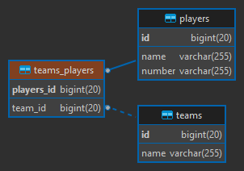
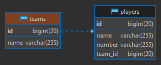
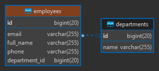

# Asociaciones de entidades usando JPA/Hibernate (Spring Data JPA): Unidireccionales y Bidireccionales

## Asociaciones Unidireccionales

### One To One

- La anotación @OneToOne en un tipo de relación unidireccional podría
  estar en cualquiera de las dos entidades relacionadas (Port o Service).
  Decidir en qué entidad irá la relación, dependerá del análisis que hagamos y
  cómo quisiéramos manejarlo.
- En nuestro caso, decidimos que la **entidad Port será dueña de la relación**,
  por lo tanto, la anotación **@OneToOne** la colocaremos en dicha entidad.
- Agregamos además la anotación **@JoinColumn(name = "service_id", unique = true)**
  en nuestra entidad dueña de la relación. Por defecto, el nombre de la Foreign Key
  generada por hibernate es igual al **nombre-del-atributo-definido_id (service_id)**.
  Si quisiéramos cambiar dicho nombre, usamos la anotación **@JoinColumn** y en el
  atributo name le definimos el nuevo nombre. En nuestro caso, estamos colocando
  el mismo nombre que por defecto nos generaría hibernate **service_id**, no habría problemas
  simplemente estamos siendo explícitos. Además, un punto importante, es que nos aseguraremos
  de que la relación sea de **one-to-one** añadiéndole una restricción de **unique=true**.
- En la anotación @OneToOne(cascade = {CascadeType.ALL}), agregamos el **CascadeType.ALL**,
  con esto podremos persistir, eliminar, etc.. un Port y su Service en cascada. Por ejemplo,
  si se quiere guardar un registro para Port, aprovechar ese guardado para poder guardar
  también su correspondiente Service.
- Nuestras dos entidades quedarían de la siguiente manera:

````
@Entity
@Table(name = "ports")
public class Port {

    @Id
    @GeneratedValue(strategy = GenerationType.IDENTITY)
    private Long id;
    private Integer number;
    private String type;

    @OneToOne(cascade = {CascadeType.ALL})
    @JoinColumn(name = "service_id", unique = true)
    private Service service;
    
    # Setters, Getters, toString()...
````

````
@Entity
@Table(name = "services")
public class Service {

    @Id
    @GeneratedValue(strategy = GenerationType.IDENTITY)
    private Long id;
    private String name;
    private String path;
    
    # Setters, Getters, toString()...
````

- Las tablas generadas en la Base de Datos serían:  
  
- En este tipo de relación unidireccional, la Foreign Key estará en la tabla
  cuya clase de entidad tiene la anotación @OneToOne (dueña de la relación),
  esto significa entonces, que nuestra tabla Ports de la BD tendrá la
  Foreign Key (service_id) de Services.

#### Listando todos los Ports

Como resultado observamos que nos devuelve la lista de los Ports junto a su
service relacionado.

```
[GET] http://localhost:8080/unidireccional/v1/one-to-one/ports
```

```
[
    {
        "id": 1,
        "number": 3306,
        "type": "tcp",
        "service": {
            "id": 1,
            "name": "MySQL",
            "path": "C:\\laragon\\bin\\mysql\\mysql-5.7.33-winx64\\bin"
        }
    }
]
```

#### Guardando Port

Solo queremos guardar datos del Port, sin datos para su service. Como resultado
se obtiene null en el atributo **service**

````
[POST] http://localhost:8080/unidireccional/v1/one-to-one/ports
````

**Request**

````
{
    "number": 8080,
    "type": "tcp"
}
````

**Response**

````
{
    "id": 7,
    "number": 8080,
    "type": "tcp",
    "service": null
}
````

#### Guardando Port y su Service

Guardamos datos del Port y su Service enviados en un mismo objeto JSON.

````
[POST] http://localhost:8080/unidireccional/v1/one-to-one/ports
````

**Request**

````
{
    "number": 3924,
    "type": "tcp",
    "service": {
        "name": "DiagTrack",
        "path": "C:\\WINDOWS\\System32\\svchost.exe"
    }
}
````

**Response**

````
{
    "id": 8,
    "number": 3924,
    "type": "tcp",
    "service": {
        "id": 2,
        "name": "DiagTrack",
        "path": "C:\\WINDOWS\\System32\\svchost.exe"
    }
}
````

#### Editando solo port (no tiene service)

Enviamos solo datos del port para poder editarlo:

````
[PUT] http://localhost:8080/unidireccional/v1/one-to-one/ports/6
````

**Request**

````
{
    "number": 5536,
    "type": "UDP"
}
````

**Response**

````
{
    "id": 6,
    "number": 5536,
    "type": "UDP",
    "service": null
}
````

#### Editando solo port (sí tiene service)

Enviamos solo datos del port para poder editarlo:

````
[PUT] http://localhost:8080/unidireccional/v1/one-to-one/ports/8
````

**Request**

````
{
    "number": 3939,
    "type": "TCP"
}
````

**Response**

````
{
    "id": 8,
    "number": 3939,
    "type": "TCP",
    "service": {
        "id": 2,
        "name": "DiagTrack",
        "path": "C:\\WINDOWS\\System32\\svchost.exe"
    }
}
````

#### Editando port y service

Enviamos datos tanto del port y service para editarlos

````
[PUT] http://localhost:8080/unidireccional/v1/one-to-one/ports/8
````

**Request**

````
{
    "number": 3939,
    "type": "TCP",
    "service": {
        "id": 2,
        "name": "Service Diag-Track",
        "path": "C:\\WINDOWS\\System32\\svchost-track.exe"
    }
}
````

**Response**

````
{
    "id": 8,
    "number": 3939,
    "type": "TCP",
    "service": {
        "id": 2,
        "name": "Service Diag-Track",
        "path": "C:\\WINDOWS\\System32\\svchost-track.exe"
    }
}
````

#### Editando Port creándole un Service

A un Port que no tiene un registro de service lo editaremos para
registrarle un service

````
[PUT] http://localhost:8080/unidireccional/v1/one-to-one/ports/6
````

**Request**

````
{
    "number": 5536,
    "type": "tcp",
    "service": {
        "name": "Servicio Windows Defender",
        "path": "C:\\WINDOWS\\System32\\windows-defender.exe"
    }
}
````

**Response**

````
{
    "id": 6,
    "number": 5536,
    "type": "tcp",
    "service": {
        "id": 3,
        "name": "Servicio Windows Defender",
        "path": "C:\\WINDOWS\\System32\\windows-defender.exe"
    }
}
````

#### Eliminando Port

Cuando eliminamos un port, eliminará al registro cuyo id pasado por parámetro
corresponda al Port en la BD y si este registro tiene relacionado un service,
lo eliminará en cascada. De allí la razón por la que colocamos el CascadeType.ALL

````
[DELETE] http://localhost:8080/unidireccional/v1/one-to-one/ports/8
````

---

### One To Many

> Por defecto (tabla_intermedia)

- En nuestra asociación de One To Many entre Team y Player, **solo usando la anotación @OneToMany**,
  **por defecto** hibernate crea una tabla intermedia entre teams y players (teams_players) con el
  identificador de cada tabla, donde
  no creará una clave primaria en esa tabla intermedia, sino más bien las siguiente constraint:
  **unique: player_id**, además los **foreing: player_id y team_id**.
- Las tablas generadas en la BD, con esta **configuración por defecto** que proporciona hibernate
  sería así:  
  
- Si quisiéramos definir nuestra propia tabla intermedia y no la que JPA/Hibernate crea por defecto,
  podemos agregar la siguiente configuración sobre la anotación @OneToMany:

````
@JoinTable(name = "tbl_teams_players",
        joinColumns = @JoinColumn(name = "team_id"),
        inverseJoinColumns = @JoinColumn(name = "player_id"),
        uniqueConstraints = @UniqueConstraint(columnNames = { "player_id" }))
@OneToMany
private List<Player> players = new ArrayList<>();
````

> Personalizada (fk en la tabla muchos)

- Si no quisiéramos que nos genere la tabla intermedia, sino más bien, al ser una asociación
  de uno a muchos unidireccional, quisiéramos que la Primary Key de la tabla principal (Teams)
  se ubique en una columna de la tabla hija (Players) como Foreign Key, únicamente agregaríamos
  la anotación **@JoinColumn(name = "team_id")** especificándole en el atributo name el nombre
  que tomará el Foreing Key (team_id) en la tabla Players.

````
¡IMPORTANTE! este tipo de configuración sólo se hace en una asociación UNIDIRECCIONAL
````

- Cuando una clase es principal, es decir una clase padre, en este caso nuestra entity
  Team sería nuestra clase principal, **debemos colocar el cascade**. Existen distintos tipos,
  el que usaremos será el CascadeType.ALL, este permitirá persistir, remover, etc.. sus
  entidades hijas (Player). Por ejemplo, cada vez que se cree o guarde un Team, automáticamente
  creará a su dependiente, es decir a sus relacionados, en nuestro caso a Player. Podemos crear
  un Team junto a sus Players y lo persistirá.
- Además, agregamos el **orphanRemoval = true**, esto significa que si se elimina la clase
  padre (Team) sus hijos no queden huérfanos, así que también serán eliminados.
- Nuestras entidades quedarían así:

````
@Entity
@Table(name = "teams")
public class Team {
    @Id
    @GeneratedValue(strategy = GenerationType.IDENTITY)
    private Long id;
    private String name;

    @JoinColumn(name = "team_id")
    @OneToMany(cascade = CascadeType.ALL, orphanRemoval = true)
    private List<Player> players = new ArrayList<>();
    
    # getters, setters, toString()...
````

````
@Entity
@Table(name = "players")
public class Player {

    @Id
    @GeneratedValue(strategy = GenerationType.IDENTITY)
    private Long id;
    private String name;
    private String number;
    
    # getters, setters, toString()...
````

- Las tablas generadas en la BD, con esta **configuración personalizada** quedarían así:  
  

#### Guardando Team y sus Players

Guardamos datos del Team y sus Players enviados en un mismo objeto JSON.

````
[POST] http://localhost:8080/unidireccional/v1/one-to-many/teams
````

**Request**

````
{
    "name": "Perú",
    "players": [
        {
            "name": "Farfan",
            "number": "10"
        },
        {
            "name": "Flores",
            "number": "20"
        },
        {
            "name": "Carrillo",
            "number": "18"
        }
    ]
}
````

**Response**

````
{
    "id": 3,
    "name": "Perú",
    "players": [
        {
            "id": 4,
            "name": "Farfan",
            "number": "10"
        },
        {
            "id": 5,
            "name": "Flores",
            "number": "20"
        },
        {
            "id": 6,
            "name": "Carrillo",
            "number": "18"
        }
    ]
}
````

#### Actualizando Team y sus Players (Eliminando players y agregando nuevos)

Actualizamos los datos del Team y los players, además de eso, agregamos nuevos players
al Team y eliminamos otros.

````
[PUT] http://localhost:8080/unidireccional/v1/one-to-many/teams/5
````

**Request**

````
{
    "name": "Argentina FC",
    "players": [
        /*Actualizar*/
        {
            "id": 12,
            "name": "Leonel Messi",
            "number": "10"
        },
        
        /*Eliminar*/
        /*
        /* {
        /*    "id": 13,
        /*    "name": "El dibu",
        /*    "number": "1"
        /* }
        */
        
        /*Agregar*/
        {
            "name": "Di María",
            "number": "11"
        }
    ]
}
````

**Response**

````
{
    "id": 5,
    "name": "Argentina FC",
    "players": [
        {
            "id": 12,
            "name": "Leonel Messi",
            "number": "10"
        },
        {
            "id": 14,
            "name": "Di María",
            "number": "11"
        }
    ]
}
````

### Many To One

- Este tipo de asociación ManyToOne unidireccional lo podríamos usar cuando no quisiéramos obtener
  los Employees de un determinado Department, sino solo saber de qué department es un employee.
- En la entidad propietaria, **dueña de la relación (Employee)** definimos un atributo que pasará a
  ser un **foreign key** de la tabla Department. En nuestro caso definimos el atributo **department**
  en nuestra **Entity Employee**.
- Por defecto, hibernate crea la foreign key con el nombre del atributo definido seguido de un guión bajo
  más el id: **nombre-del-atributo-definido_id**.
- Si quisiéramos cambiar el nombre de la foreign key creada automáticamente, podemos usar
  la anotación **@JoinColumn(name = "department_id")**. En este caso, estamos definiendo explícitamente
  el mismo nombre (department_id) que hibernate crearía.
- Nuestras dos entidades quedarían de la siguiente manera:

````
@Entity
@Table(name = "employees")
public class Employee {
    @Id
    @GeneratedValue(strategy = GenerationType.IDENTITY)
    private Long id;
    private String fullName;
    private String phone;
    private String email;

    @ManyToOne
    @JoinColumn(name = "department_id")
    private Department department;
    
    # Getters, Setters, toString()...
````

````
@Entity
@Table(name = "departments")
public class Department {
    @Id
    @GeneratedValue(strategy = GenerationType.IDENTITY)
    private Long id;
    private String name;
    
    # Getters, Setters, toString()...
````

- Las tablas generadas en la BD, quedarían así:  
  

#### Guardando Employee a un department existente en la BD

- Creamos un nuevo empleado y lo guardamos asociándolo a un departamento
  existente en la BD.
- **¡ATENCIÓN!**, para guardar un nuevo empleado junto a su departamento, este último
  debe existir en la base de datos.
- **¡ATENCIÓN!**, No es necesario pasar todos los atributos del **department**, solo se requiere
  el id, esto es porque solo requerimos el id para poder asociarlo al Employee
  como Foreign Key. Ahora, si solo se pasa el id, como respuesta vendrá en el objeto
  json los atributos del department en null, excepto el id. Ahora, si quisiéramos
  que la respuesta también contenga los datos completos del department, entonces
  debemos modificar el código del EmployeeResource para hacer otra consulta y obtener
  los datos completos del Employee y Department, simplemente haciendo un **findById(id-del-empleado)**.

````
[POST] http://localhost:8080/unidireccional/v1/many-to-one
````

**Request**

````
{
    "fullName": "Gabriel Abraham",
    "phone": "948759685",
    "email": "shaga_arga9@gmail.com",
    "department": { <------------- Este departamento existe en la BD
        "id": 1,
        "name": "Systems"
    }
}
````

**Response**

````
{
    "id": 2,
    "fullName": "Gabriel Abraham",
    "phone": "948759685",
    "email": "shaga_arga9@gmail.com",
    "department": {
        "id": 1,
        "name": "Systems"
    }
}
````
